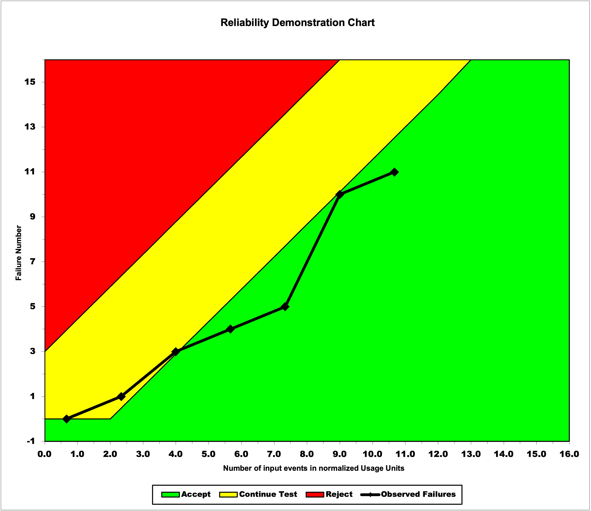
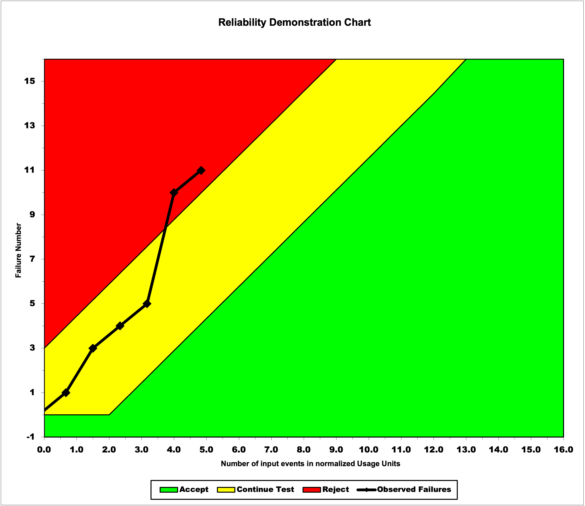
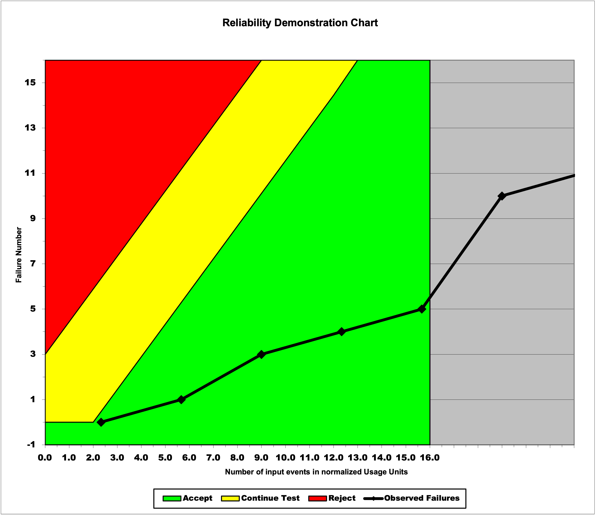

**SENG 438- Software Testing, Reliability, and Quality**

**Lab. Report \#5 – Software Reliability Assessment**

| Group: 08      |
|-----------------|
| Student 1: Sufyan Ayaz                |   
| Student 2: Muhammad Haris Kashif              |   
| Student 3: Faisal Islam               |   
| Student 4: Taha Khan                |

# Introduction

# 

# Assessment Using Reliability Growth Testing 

## Discussion on Decision Making Given A Target Failure Rate
A failure rate refers to the frequency of failures occurring within a time frame, therefore, a target failure rate is the failure rate that is expected to be achieved by the SUT in order to demonstrate an acceptable enough level of reliability.

The corrleation between the target failure rate and decision making when it comes to the SUT is that the target failure rate is compared with the current failure rate of the SUT and is used as a guide for developers when they are determining how much effort needs to be allocated to improving said SUT. When the chosen target failure rate is high, chances are that the SUT's current failure rate is already quite near, if not less than the target failure rate, and is therefore almost meeting its desired relaibility. In this scenario, developers can decide to allocate less time and resources towards testing to improve the SUT's reliability. On the other hand, if the chosen target failure rate is low, chances are that more failures are occuring than what is acceptable, making the current failure rate too high for the SUT to be considered as reliable. In this scenario, developers are forced to make the decision of allocating more time and resources to testing and analysing the SUT in order to reduce the number of failures occuring, and bring the failure rate down to a level that is acceptable enough to label the SUT as reliable.

To exemplify how the decision-making process can be affected by a target failure rate, we will calculate the failure of our SUT, the system used for failure report 9. In order to calculate the failure rate for a SUT, the formula is `λ = 1/MTTF`, where `MTTF (Mean Time to Failure) = Total Time/Number of Failures`. This means that for our system, the failure rate is calculated as follows:

`MTTF = Total Time/Number of Failures = 52.5 minutes/30 failures = 1.75 minutes per failure`

`λ = 1/MTTF = 1/1.75 minutes per failure = 0.5714 failures per minute = 0.00952 failures per second`

Using the formulas, we are able to calculate the failure rate of the system used in failure report 9 as being 0.00952 failures per second. Now, since we did not have a target failure rate, we can't make an exact decision on how developers should proceed with the system, but if we were given a target failure rate that is higher than 0.00952 failures per second, we would decide that the system is reliable enough and does not need to be further tested or analyzed. On the other hand, if we were given a target failure rate that is lower than 0.00952 failures per second, we would decide to allocate resources towards testing and analyzing the system, so that the number of failures is reduced and the system becomes reliable enough to be used in production.

## Discussion on the Advantages and Disadvantages of Reliability Growth Analysis

Reliability growth analysis is an anlytical method that uses failure counts and the time between failures as metrics to determine reliability of a SUT over time, allowing the assessment of the reliability growth test to determine whether the SUT needs to be made more reliable or not. Interacting with the Reliability Growth Testing and anlyzing its graphs, our group has come to the conclusion of relaibility growth analysis having the following advantages and disadvantages:

### Advantages:
1. Using reliability growth analysis provides developers with a quantitive measure of the reliability of a system, which will allow them to determine whether the system is ready to be released to users.

2. Developers are provided with a way to determine whether the SUT is meeting the target failure rate, giving them a way to decide whether they need to allocate more time and resources to testing and development and how much they need to allocate, potentially reducing costs.

3. The graphs used for reliability growth anlysis allow developers to not only assess the reliability of the SUT in the past, but to also predict the how the reliability of the SUT will change in the future.

### Disadvantages:
1. Reliability growth analysis depends on the SUT having a large failure dataset. If the SUT has a lot of failures, reliability growth analysis is an accurate way to determine reliability, but if the SUT doesn't have many failures, using reliability growth analysis becomes ineffective as it isn't very accurate.

2. The reliability growth analysis also requires failure data to be quite heavily pre-processed, which can be quite time-consuming.

3. Each tool with which reliability growth analysis can be conducted requires the data to be inputted in its own specific format, which requires a thorough knowledge of the failure dataset and is quite a tedious process.

4. Using the reliability growth analysis method also requires quite in-depth knowledge and understanding of what different models and visualizations mean on the develpoer's end. Different tools can visulaize the failure data in different ways and the use of different mathematical formulas can create differring models, and so it becomes necessary for the developer to be competent at using the tools for reliability growth analysis.

# Assessment Using Reliability Demonstration Chart 
text and stuff here

## MTTFmin Chart

## MTTFmin (Twice) Chart

## MTTFmin (Half) Chart

# Comparison of Results

# Discussion on Similarity and Differences of the Two Techniques

# How the team work/effort was divided and managed

For this lab, our team utilized Discord as our main form of communication. Before beginning the lab, we all decided to have a virtual meeting on Discord to help us set up our tools and pick our datasets. This required a few meetings as we initially struggled with creating our datasets. Once we chose our datasets, we decided to split the work. Since Faisal and Haris were not able to run the C-SFRAT and SRTAT softwares, and also because they had a better understanding of the Reliability Demonstration Chart portion of the labe, Faisal and Haris completed Part 2 using the RDC excel chart, while Sufyan and Taha worked on the Reliability Growth Testing in Part 1 using the C-SFRAT and SRTAT technologies. After we divided up the work and split up the tasks for each part, each pair seperately completed their tasks and the portions of the report relevent to their tasks. Once each pair completed their portion of the report, we all regrouped and reviewed each others additions to ensure that we all had an adept understanding of what was going on in each part, and were able to get rid of any errors that were missed by the other pair.

# Difficulties encountered, challenges overcome, and lessons learned

In this lab assignment, we were faced with quite a bit of challenges, especially initially. The main challenge we faced was gathering the data into an appropriate format. None of the provided datasets were in the correct format, and there were no instructions that helped with giving us a starting point either, so the majority of the time we spent on this lab went towards simply figuring out how to pre-process the given datasets into the correct format. We were eventually able to take a step in the direction of overcoming this challenge through the help of the TAs in discussion posts, where we learned that we could use 0's as placeholders for columns that we were not able to calculate, which allowed us to create a dataset that would work with the C-SFRAT software. Another challenge that we faced during this assignment was using the tools. There was no instructions or documentation that was provided on how to use the tools in this assignment, and so when we did have a dataset we weren't able to understand how to use those datasets with the provided. Overcoming this challenge was tedious, and was basically just us doing trial-and-error until something worked, which happened to be the C-SFRAT and the RDC-11 Excel Macro Worksheet. Finally, a third challenge that we faced was being able to go through and complete all the required steps. Because we didn't have any instructions, and the ones we did have were very vague, it was difficult to know how to complete each of the required steps and whether what we were doing for each step was even correct or not. Overcoming this challenge, again, required a lot of trial-and-error on our part as well as making assumptions (which we listed as we made them).

In terms of our lessons learned, once we got the ball rolling, we were able to kind of figure out how the tools in this assignment were working, as well as were able to understand the theory behind reliability testing and demonstration that was being put into practice in this assignment.

# Comments/feedback on the lab itself

Sufyan: Overall, this was definitly my least favorite of the lab assignments. Even though we were able to get a good introduction to the importance and precence of reliability in software systems through Reliability Growth Testing and the Reliability Demonstration Charts, the way that this lab was executed was not ideal. Because of how vague the instructions were, there was a strong lack of guidance, which resulted in our group spending more time setting up the lab and figuring out what to do than actually doing the tasks and learning from them. For the future, I would definitly recommend adding a more comprehensive set of instructions that can help students get started, so that they can actually learn about reliability rather than wasting their time.
