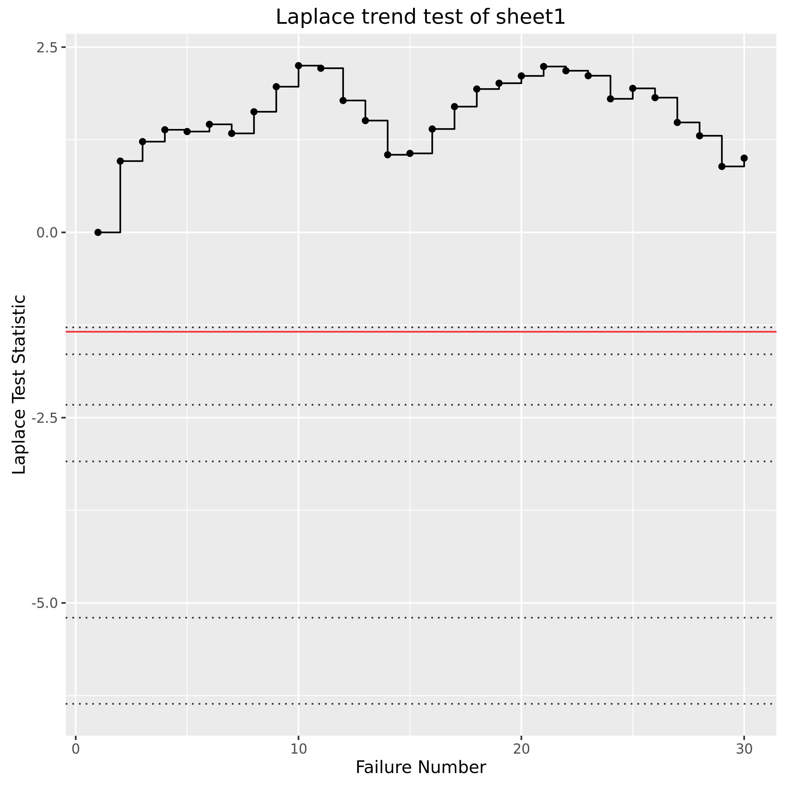
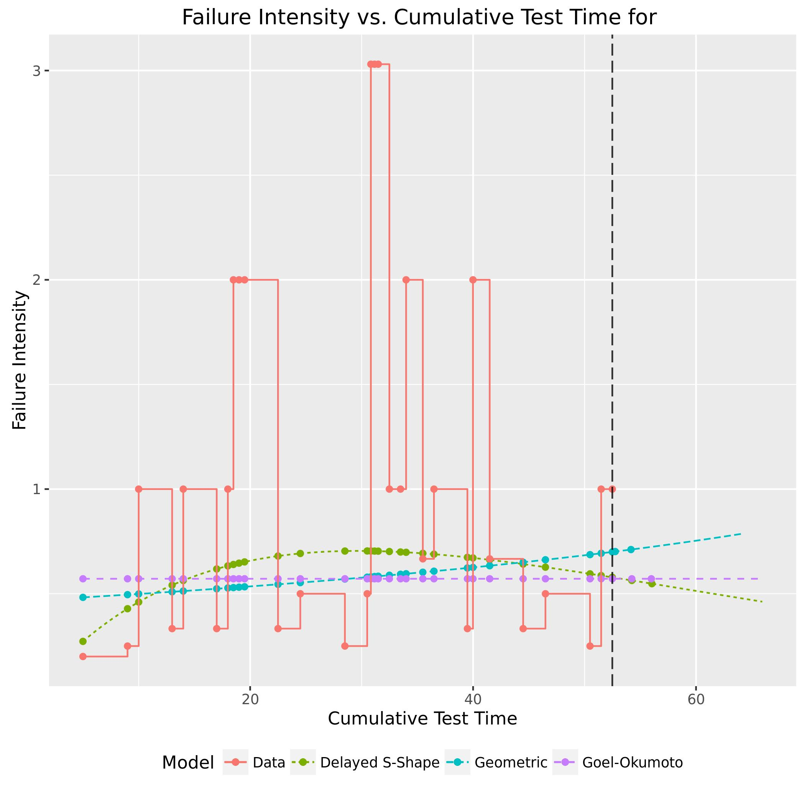
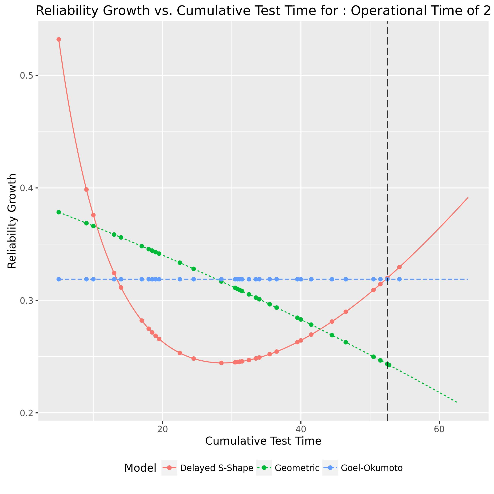

**SENG 438- Software Testing, Reliability, and Quality**

**Lab. Report \#5 – Software Reliability Assessment**

| Group: 08      |
|-----------------|
| Student 1: Sufyan Ayaz                |   
| Student 2: Muhammad Haris Kashif              |   
| Student 3: Faisal Islam               |   
| Student 4: Taha Khan                |

# Introduction
In this lab, we were given the task of using different reliability tools to observe and analyze test and failure data. We did so using two different reliability assessment techniques: Reliability Growth Testing and Reliability Demonstration Chart (RDC). We opted to use the **C-SFRAT** tool for Reliability Growth Testing and the **RDC11 Excel Worksheet** for the Reliability Demonstration Chart to analyze the data and create plots. For both Reliability Growth Testing and for the Reliability Demonstration Chart we used the data from **Failure Report 9**. The purpose of this lab is to introduce us to integration test data analysis using different reliability assessment tools and techniques, and comparing between them. 

# Assessment Using Reliability Growth Testing 

## Original dataset

## All models and covariate

## Result of model comparison

The two models that we selected that would provide the best fit for the project data, from the 64 different models, were NB2 with no covariates and S with no covariates. This is because when using the provided model rankings many models tied with the same log-likelihood of -65.227, and the way that log-likelihood works is that the higher the value the better the fit the model is for the dataset. In terms of all the other metrics the lower the value the better the model. As a result we then took all the models that tied and compared their other metrics. NB2 with no covariates had the lowest AIC, BIC and SSE (tied at 0) however it did not have the lowest PSEE, however because NB2 with no covariates had so many lowest values in all the other metrics we chose it as our first choice. For our second choice we once again looked at the models that tied for the lowest log-likelihood at -65.227, and began looking at their other metrics. After closely examining the values we noticed that the model named S with no covariates would be the best second choice, as it is tied for the lowest AIC and has a very low BIC, tied for the lowest SSE and also has a very low PSSE. A Lot of the other models tend to have low values but in one or two metrics their values are very high. As a result we decided to pick the model NB2 with no covariates and the model S with no covariates.

## Range analysis

In order to do the range analysis, we used the SFRAT tool, and generated the laplace trend test and the running average trend test. For the laplace trend test, negative values of the laplace factor indicate a decreasing failure intensity and thus show reliability growth. On the other hand, positive values of the laplace factor indicate an increasing failure intensity, and thus a reliability decrease. Any of the values in between -2 and +2 indicate a stable reliability. When looking at our laplace graph it can be seen that all the values are positive, some values are above 2 so these would indicate a decrease in reliability as the values between -2 and 2 would show there to be stable reliability. However it can be seen that there are no ranges where the laplace factor is less than -2, and as result there is no range with reliability growth. However you can also use the decrease in the laplace factor as an indicator for an increase in reliability as the value is becoming more negative, so the range of 10 - 14 can be seen as a range with slightly higher reliability then the rest although the reliability itself is not that high, its higher in that range then other ranges. When looking at the running average graph we come to a similar conclusion, as with the running average graph an increase in the average indicates an increase in the reliability. When looking at the graph, you can see that during the range of 10 - 14 there is a slight increase in the reliability of the graph.

## Plots for failure rate and reliability of the SUT for the test data provided

## Discussion on Decision Making Given A Target Failure Rate
A failure rate refers to the frequency of failures occurring within a time frame, therefore, a target failure rate is the failure rate that is expected to be achieved by the SUT in order to demonstrate an acceptable enough level of reliability.

The corrleation between the target failure rate and decision making when it comes to the SUT is that the target failure rate is compared with the current failure rate of the SUT and is used as a guide for developers when they are determining how much effort needs to be allocated to improving said SUT. When the chosen target failure rate is high, chances are that the SUT's current failure rate is already quite near, if not less than the target failure rate, and is therefore almost meeting its desired relaibility. In this scenario, developers can decide to allocate less time and resources towards testing to improve the SUT's reliability. On the other hand, if the chosen target failure rate is low, chances are that more failures are occuring than what is acceptable, making the current failure rate too high for the SUT to be considered as reliable. In this scenario, developers are forced to make the decision of allocating more time and resources to testing and analysing the SUT in order to reduce the number of failures occuring, and bring the failure rate down to a level that is acceptable enough to label the SUT as reliable.

To exemplify how the decision-making process can be affected by a target failure rate, we will calculate the failure of our SUT, the system used for failure report 9. In order to calculate the failure rate for a SUT, the formula is `λ = 1/MTTF`, where `MTTF (Mean Time to Failure) = Total Time/Number of Failures`. This means that for our system, the failure rate is calculated as follows:

`MTTF = Total Time/Number of Failures = 52.5 minutes/30 failures = 1.75 minutes per failure`

`λ = 1/MTTF = 1/1.75 minutes per failure = 0.5714 failures per minute = 0.00952 failures per second`

Using the formulas, we are able to calculate the failure rate of the system used in failure report 9 as being 0.00952 failures per second. Now, since we did not have a target failure rate, we can't make an exact decision on how developers should proceed with the system, but if we were given a target failure rate that is higher than 0.00952 failures per second, we would decide that the system is reliable enough and does not need to be further tested or analyzed. On the other hand, if we were given a target failure rate that is lower than 0.00952 failures per second, we would decide to allocate resources towards testing and analyzing the system, so that the number of failures is reduced and the system becomes reliable enough to be used in production.

## Discussion on the Advantages and Disadvantages of Reliability Growth Analysis

Reliability growth analysis is an anlytical method that uses failure counts and the time between failures as metrics to determine reliability of a SUT over time, allowing the assessment of the reliability growth test to determine whether the SUT needs to be made more reliable or not. Interacting with the Reliability Growth Testing and anlyzing its graphs, our group has come to the conclusion of relaibility growth analysis having the following advantages and disadvantages:

### Advantages:
1. Using reliability growth analysis provides developers with a quantitive measure of the reliability of a system, which will allow them to determine whether the system is ready to be released to users.

2. Developers are provided with a way to determine whether the SUT is meeting the target failure rate, giving them a way to decide whether they need to allocate more time and resources to testing and development and how much they need to allocate, potentially reducing costs.

3. The graphs used for reliability growth anlysis allow developers to not only assess the reliability of the SUT in the past, but to also predict the how the reliability of the SUT will change in the future.

### Disadvantages:
1. Reliability growth analysis depends on the SUT having a large failure dataset. If the SUT has a lot of failures, reliability growth analysis is an accurate way to determine reliability, but if the SUT doesn't have many failures, using reliability growth analysis becomes ineffective as it isn't very accurate.

2. The reliability growth analysis also requires failure data to be quite heavily pre-processed, which can be quite time-consuming.

3. Each tool with which reliability growth analysis can be conducted requires the data to be inputted in its own specific format, which requires a thorough knowledge of the failure dataset and is quite a tedious process.

4. Using the reliability growth analysis method also requires quite in-depth knowledge and understanding of what different models and visualizations mean on the develpoer's end. Different tools can visulaize the failure data in different ways and the use of different mathematical formulas can create differring models, and so it becomes necessary for the developer to be competent at using the tools for reliability growth analysis.

# Assessment Using Reliability Demonstration Chart 
For this section of the lab, we decided to use the RDC-11 Excel Macro Worksheet. For our data we chose **Failure Report 9**. 

The original dataset had 30 rows of logged failures, however the sheet only permitted 16 rows. To deal with our data (the Cumulative Time column), we first converted it to seconds. The last failure occurs at 3150s (52.5 mins) so we divided this by 16 and rounded up to 200s to establish our intervals, and we assumed the execution end time of the SUT to be 3200s, as we don't know for sure if the SUT ended execution at 3150s or not. We manually calculated the Cumulative Failure Count (CFC) at each interval to populate this part of the data required for the RDC, and as mentioned previously our Input Event When Observed is just each 200s interval up to 3200s. 

To calculate our MTTF, we used the formula `Total Time / Number of Failures` which in our case yielded an MTTF of `3200 \ 30 = 106.66...`. After inputting this MTTF value, we experimented with the RDC and learned how to use it until we could find our MTTFmin value, which we observed to be 120. 

**MTTF:** *106.6 seconds / failure*\
**MTTFmin:** *120 seconds / failure*

## MTTFmin Chart

## MTTFmin (Twice) Chart

## MTTFmin (Half) Chart

### Advantages of RDC
- Easy to visualize and interpret data
- Easy method to assess the SUT's reliability
- Intuitive to use and observe reliability trends

### Disadvantages of RDC
- Time consuming to use, as it requires a lot of data conversion and interpretation before the data is able to provide meaningful insights using the tool
- Imprecise, only gives a general idea of patterns regarding reliability
- Calculating the MTTF and MTTFmin can get confusing since it has to be done manually and experimentally. It requires manual calculations along with an analysis of the data using the calculated values, and even then it is unclear what would be considered "acceptable" 

# Comparison of Results
Reliability Growth Testing provided insights into the Mean Time to Failure (MTTF) of the system, calculated at approximately 1.75 minutes per failure (106.6 seconds per failure). This shows the current performance of the system in terms of failure frequency and sets a baseline for comparison against target failure rates. The comparison with target failure rates suggests that if the target rate is higher than the calculated MTTF, the system may be considered reliable without additional testing or analysis. However, if the target rate is lower, it suggests that more resources should be used to reduce the failure rate and increase system reliability.

The Reliability Demonstration Chart offered a specific Minimum MTTF (MTTFmin) value of 120 seconds per failure. Comparing this MTTFmin with the MTTF derived from Reliability Growth Testing revealed that the system's current performance falls short of the minimum acceptable reliability level.

Overall, the combined use of Reliability Growth Testing and the Reliability Demonstration Chart allows for a detailed assessment of the system's reliability. While Reliability Growth Testing provides insights into future performance trends and potential improvements over time, the Reliability Demonstration Chart offers a more immediate assessment of whether the system meets specific reliability targets. So ideally, the SUT's reliability and readiness for release requires consideration of predictive modeling, actual failure rates, target failure rates, and good reliability benchmarks.

# Discussion on Similarity and Differences of the Two Techniques

After using both, Reliability growth testing and reliability demonstration chart (RDC), we can see that they share the same overall goal of assessing the reliability of a System Under Test (SUT) but differ in their approach and the type of decision-making they offer. Reliability growth testing focuses more on predictive modeling, using current data and target failure rates to guide resource allocation decisions and predict the SUT's future reliability performance. However, RDC analysis provides a more concrete assessment at a specific point in time, calculating metrics like MTTFmin as a benchmark for acceptance or rejection based on observed failures. While reliability growth testing offers dynamic insights and resource allocation, RDC analysis provides a static assessment against established reliability thresholds. Combining both techniques can provide a good understanding of the SUT's reliability characteristics and support better decision-making.

# How the team work/effort was divided and managed

For this lab, our team utilized Discord as our main form of communication. Before beginning the lab, we all decided to have a virtual meeting on Discord to help us set up our tools and pick our datasets. This required a few meetings as we initially struggled with creating our datasets. Once we chose our datasets, we decided to split the work. Since Faisal and Haris were not able to run the C-SFRAT and SRTAT softwares, and also because they had a better understanding of the Reliability Demonstration Chart portion of the labe, Faisal and Haris completed Part 2 using the RDC excel chart, while Sufyan and Taha worked on the Reliability Growth Testing in Part 1 using the C-SFRAT and SRTAT technologies. After we divided up the work and split up the tasks for each part, each pair seperately completed their tasks and the portions of the report relevent to their tasks. Once each pair completed their portion of the report, we all regrouped and reviewed each others additions to ensure that we all had an adept understanding of what was going on in each part, and were able to get rid of any errors that were missed by the other pair.

# Difficulties encountered, challenges overcome, and lessons learned

In this lab assignment, we were faced with quite a bit of challenges, especially initially. The main challenge we faced was gathering the data into an appropriate format. None of the provided datasets were in the correct format, and there were no instructions that helped with giving us a starting point either, so the majority of the time we spent on this lab went towards simply figuring out how to pre-process the given datasets into the correct format. We were eventually able to take a step in the direction of overcoming this challenge through the help of the TAs in discussion posts, where we learned that we could use 0's as placeholders for columns that we were not able to calculate, which allowed us to create a dataset that would work with the C-SFRAT software. Another challenge that we faced during this assignment was using the tools. There was no instructions or documentation that was provided on how to use the tools in this assignment, and so when we did have a dataset we weren't able to understand how to use those datasets with the provided. Overcoming this challenge was tedious, and was basically just us doing trial-and-error until something worked, which happened to be the C-SFRAT and the RDC-11 Excel Macro Worksheet. Finally, a third challenge that we faced was being able to go through and complete all the required steps. Because we didn't have any instructions, and the ones we did have were very vague, it was difficult to know how to complete each of the required steps and whether what we were doing for each step was even correct or not. Overcoming this challenge, again, required a lot of trial-and-error on our part as well as making assumptions (which we listed as we made them).

In terms of our lessons learned, once we got the ball rolling, we were able to kind of figure out how the tools in this assignment were working, as well as were able to understand the theory behind reliability testing and demonstration that was being put into practice in this assignment.

# Comments/feedback on the lab itself

Sufyan: Overall, this was definitly my least favorite of the lab assignments. Even though we were able to get a good introduction to the importance and precence of reliability in software systems through Reliability Growth Testing and the Reliability Demonstration Charts, the way that this lab was executed was not ideal. Because of how vague the instructions were, there was a strong lack of guidance, which resulted in our group spending more time setting up the lab and figuring out what to do than actually doing the tasks and learning from them. For the future, I would definitly recommend adding a more comprehensive set of instructions that can help students get started, so that they can actually learn about reliability rather than wasting their time.

Faisal: Overall I did not really enjoy this lab as well. While I understand the importance of testing the reliability of our SUT using different methods and reliability assessment techniques, the lab was very frustrating to work on. The lack of documentation, direction, instructions, and guidance regarding the assignment was sparse, vague, and the expectations were quite unclear compared to prior assignments. As a result, I beleive our group wasted a large amount of time just trying to figure out what was going on, which dataset to use, attempting to understand and parse the datasets that we were provided, etc. I believe we could have benefitted from a more robust and direct set of instructions. 

Haris: While I didn't dislike this lab, it was the one that I enjoyed the least. I understand the purpose behind the lab, and why we are being asked to do it, but I felt like the way the lab was structured made it difficult to get a good understanding of reliability assessments. The reason why I feel this way is because the lab didn't include the proper instructions or guidance that would have been helpful in getting a better understanding. It was really vague and left us to assume a lot rather than helping us understand. Overall, it did help me get a bit of a better understanding of reliability testing, but it was not as helpful as the previous labs were.

Taha: In comparison to other lab assignments, this one stood out as my least favorite. Despite covering important concepts like Reliability Growth Testing and Reliability Demonstration Charts, the execution of this particular lab left much to be desired. The vague instructions provided little guidance, leading our group to spend more time grappling with setup and task comprehension than actually engaging with the material and learning from it. 
